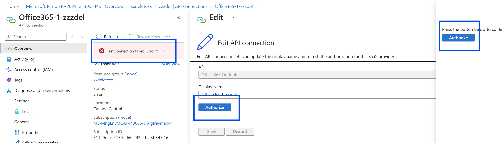
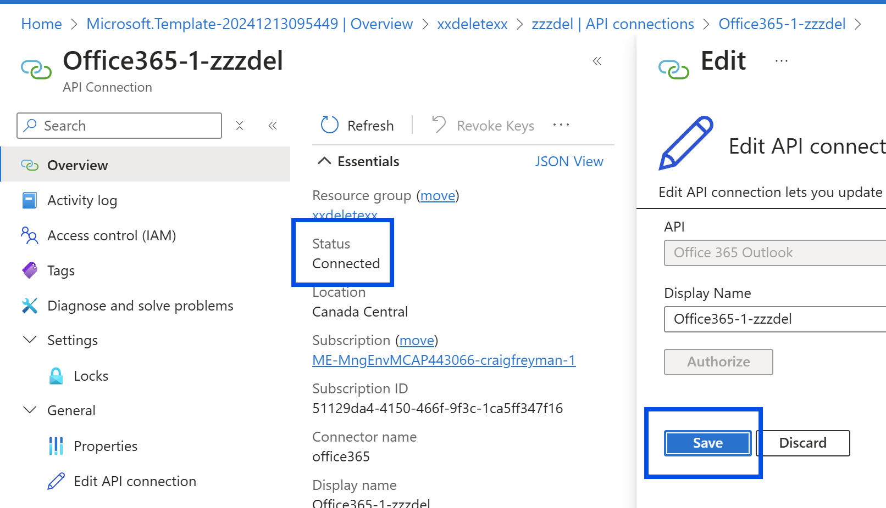
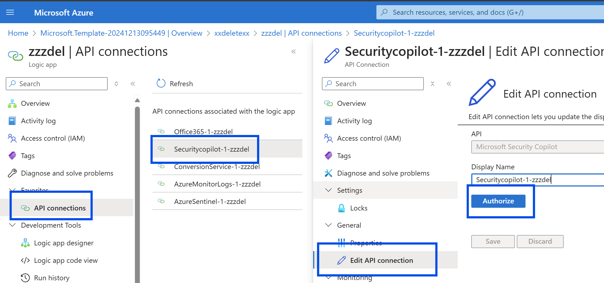

# User Submitted Phishing Analysis with Security Copilot
Author: Craig Freyman

This solution automates the analysis of user-submitted phishing emails using Security Copilot. It is highly flexible and can work with or without integration with Microsoft Defender for Office 365 Report Phishing capability.

---

### **Integration with Defender (Optional)**
If Microsoft Defender for Office 365 is used, emails reported by users via the **Report Phishing** button are forwarded to a configured shared mailbox, and Defender creates an associated incident. This Logic App can monitor that shared mailbox, process the submitted emails, and automatically add the analysis results to the associated Defender or Sentinel incidents. The mailbox configuration can be set up in Defender by following the guidelines [here](https://learn.microsoft.com/en-us/defender-office-365/submissions-user-reported-messages-custom-mailbox).

### **Standalone Email Reporting**
For environments without Microsoft Defender or the **Report Phishing** functionality, this solution can be configured to analyze emails sent to any shared mailbox. After processing, the Logic App generates an HTML report and emails the results to a specified address, without the need for Defender or Sentinel integration.

### **Behavioral and Psychological Analysis**
This solution does not rely on threat intelligence or typical indicators of compromise, as these are already handled by your email gateway and security products. Instead, it focuses on analyzing the behavioral and psychological traits of the email, primarily based on the content and structure of the email body. This allows for detecting sophisticated phishing attempts that evade traditional signature or indicator-based defenses.

This flexibility allows organizations to deploy the solution in a variety of configurations based on their existing security infrastructure.

---

## Features

- **Automated Phishing Analysis**: Processes user-submitted phishing emails in real time.
- **Integration with Office 365**: Monitors a shared mailbox for new email submissions.
- **Advanced Email Analysis**: Leverages Security Copilot to detect phishing, spam, and suspicious communications.
- **HTML Report Generation**: Produces structured HTML reports for email analysis.
- **Integration with Sentinel/Defender**: Updates incidents with detailed analysis, including links to related data.

---

## Prerequisites

Before deploying the solution, ensure the following prerequisites are met:

### Managed Identity
1. Create a **User-Assigned Managed Identity (UAMI)** in Azure.
2. Assign the following roles to the Managed Identity:
   - **Azure Reader**: Provides read-only access to Azure resources.
   - **Microsoft Sentinel Reader**: Allows the Logic App to read Sentinel data for analysis and incident updates.
   - **Graph API Access**: Assign the `Directory.Read.All` permission (Read Directory data) in the Microsoft Graph API. This enables the solution to pull Entra profile data and integrate it into the Security Copilot analysis.

  The following powershell run by a Security Administrator assigns the Graph permission to the managed identity: 
  ```powershell
  $TenantID="your tenant id"
  $GraphAppId = "00000003-0000-0000-c000-000000000000"
  $DisplayNameOfMSI="read-entra-profiles"
  $PermissionName = "Directory.Read.All"

  # Install the module
  Install-Module AzureAD
  Connect-AzureAD -TenantId $TenantID
  $MSI = (Get-AzureADServicePrincipal -Filter "displayName eq '$DisplayNameOfMSI'")
  Start-Sleep -Seconds 10
  $GraphServicePrincipal = Get-AzureADServicePrincipal -Filter "appId eq '$GraphAppId'"
  $AppRole = $GraphServicePrincipal.AppRoles | `
  Where-Object {$_.Value -eq $PermissionName -and $_.AllowedMemberTypes -contains "Application"}
  New-AzureAdServiceAppRoleAssignment -ObjectId $MSI.ObjectId -PrincipalId $MSI.ObjectId `
  -ResourceId $GraphServicePrincipal.ObjectId -Id $AppRole.Id
  ```

  Ensure the Managed Identity is in the correct resource group and note the name and resource group for use in subsequent deployment steps.

### Shared Mailbox
1. Configure an Office 365 shared mailbox where phishing emails will be submitted. https://learn.microsoft.com/en-us/microsoft-365/admin/email/create-a-shared-mailbox?view=o365-worldwide
2. Ensure that the mailbox is accessible via the Logic App and has the necessary API connections set up.

### Additional Resources
1. Ensure an **Azure Function App** is created and available for deployment.
2. Verify that a **Log Analytics Workspace** is configured for Sentinel integration.
3. Ensure **Security Copilot** has been properrly deployed.

Note: Ensure you have the required permissions and access to create and manage the above resources in your Azure environment.

---

## Deploy the Solution

### Step 1: Deploy the Function App

Click the button below to deploy the Function App. Provide a unique Function App name and select a resource group. Ensure the Function App is fully deployed before proceeding with the Logic App deployment.

[](https://portal.azure.com/#create/Microsoft.Template/uri/https%3A%2F%2Fraw.githubusercontent.com%2Fcd1zz%2Fsecuritycopilot%2Fmain%2FLogicApps%2FPhishingLogicApp%2FPhishingLA_Sentinel_Comments%2Ffunctionapp_azuredeploy.json)

If needed, you can deploy the Function App manually using the command line:
```bash
az functionapp deployment source config-zip --resource-group yourresourcegroup --name youremptyfunctionapp --src .\FunctionApp.zip
```
Download the ZIP file before running this command.

---

### Step 2: Deploy the Logic App

Click the button below to deploy the Logic App. You will be prompted to input the following parameters during deployment:

- **SubscriptionId**: The Azure subscription ID where the resources will be deployed.
- **LogicAppName**: The name of the Logic App to be deployed.
- **IntegrationAccountName**: The name of the Integration Account to link with the Logic App. Required for running inline code for regex purposes. Created during this deployment.
- **ManagedIdentityName**: The User-Assigned Managed Identity (UAMI) to provide permissions to resources. UAMI must be created prior to deployment. Grant 'Reader,' 'Microsoft Sentinel Reader,' and Graph API `Directory.Read.All` permissions.
- **ManagedIdentityResourceGroupName**: The resource group where the Managed Identity is located.
- **FunctionAppName**: The name of the Azure Function App created earlier, which will be called by the Logic App.
- **FunctionAppResourceGroup**: The name of the resource group where the Function App is deployed.
- **LogAnalyticsWorkspaceName**: The name of the Log Analytics Workspace associated with Sentinel.
- **LogAnalyticsWorkspaceId**: The workspace ID of the Log Analytics Sentinel Workspace.
- **LogAnalyticsResourceGroup**: The resource group name of the Log Analytics Sentinel Workspace.
- **SharedMailboxAddress**: Email address of the shared O365 mailbox.
- **DestinationForHTMLReport**: Email address where the HTML report should be sent.

[](https://portal.azure.com/#create/Microsoft.Template/uri/https%3A%2F%2Fraw.githubusercontent.com%2Fcd1zz%2Fsecuritycopilot%2Frefs%2Fheads%2Fmain%2FLogicApps%2FPhishingLogicApp%2FPhishingLA_Sentinel_Comments%2Flogicapp_azuredeploy.json)

---

### Step 3: Enable API Connections

After deploying the Logic App, open the Logic App Designer in the Azure portal. Enable the following API connections:

1. **Office 365 Shared Inbox**


Authorize with an account that has been added as a member to the shared mailbox.


Save the connection and confirm Status:

2. **Security Copilot**
Authorize Security Copilot with an account that has been granted access to Security Copilot. Authorize, and Save the connection.


3. **Azure Monitor Logs Actions**
From the Logic App designer, confirm that the "Query to get systemalertid" is assigned to your managed identity and that there are no errors. 

4. **Sentinel Actions**
From the Logic App designer, confirm that the "Alert - Get incident from systemalertid" is assigned to your managed identity and that there are no errors. 

5. **Conversion Service**
No action needed.

---

### Step 4: Enable the Logic App

The Logic App is deployed in a disabled state. Go to the Logic App Overview and click the "Enable" button when you are ready to test.

---

## Workflow Overview

### **Logic App Workflow Details**

1. **Mailbox Monitoring**: Monitors a shared Office 365 mailbox and triggers on new email arrivals.
2. **Email Parsing**: Extracts key details like sender, recipient, subject, URLs, and attachments.
3. **Security Analysis**: Leverages Security Copilot to classify emails and identify phishing attempts.
4. **HTML Report**: Creates a detailed HTML report summarizing the analysis.
5. **Incident Updates**: Updates Sentinel incidents with the report, including a timestamp and AI-generated disclaimer.

---

### **Core Analysis Process**

#### Behavioral Triggers Analysis
- Identifies coercive language or emotional triggers.
- Evaluates alignment with the email's stated purpose.

#### Logical Coherence
- Assesses content consistency and plausibility.
- Flags contradictions, vagueness, or illogical requests.

#### Contextual Integrity
- Evaluates formatting, terminology, and attachment relevance.
- Detects placeholder-like data or unrealistic content.

#### Intent Verification
- Infers the sender's likely intent and evaluates potential risks.

#### URL and Attachment Analysis
- Categorizes URLs and analyzes their alignment with trusted domains.
- Assesses attachments for relevance and security risks.

#### Final Classification
- Categorizes emails as **Phishing**, **Junk/Spam**, **Legitimate**, or **Suspicious**.

---

## Notes

- Regularly review and update the Function App code to maintain compatibility with dependencies.
- Ensure all necessary API connections and permissions are properly configured.
- For manual deployments, confirm the Logic App uses the correct Function App and managed identity.

For questions or troubleshooting, please refer to the [GitHub repository](https://github.com/cd1zz/securitycopilot) for documentation and support.

