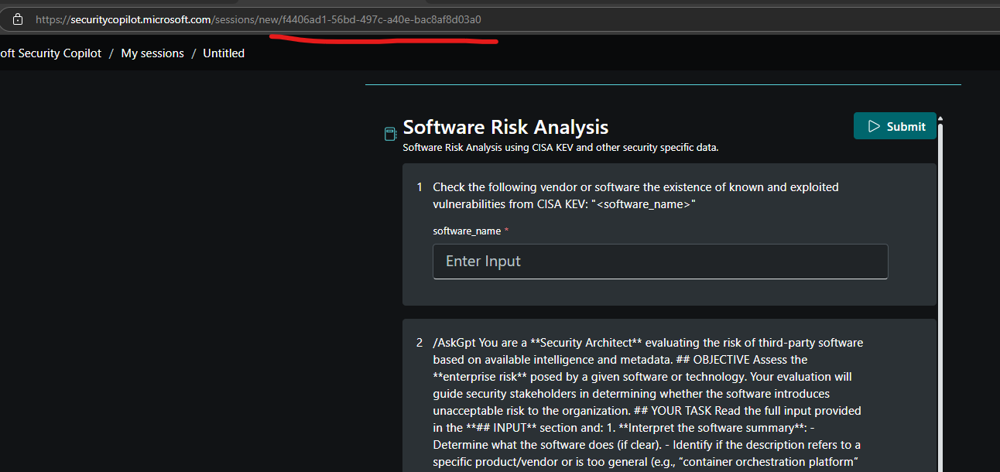
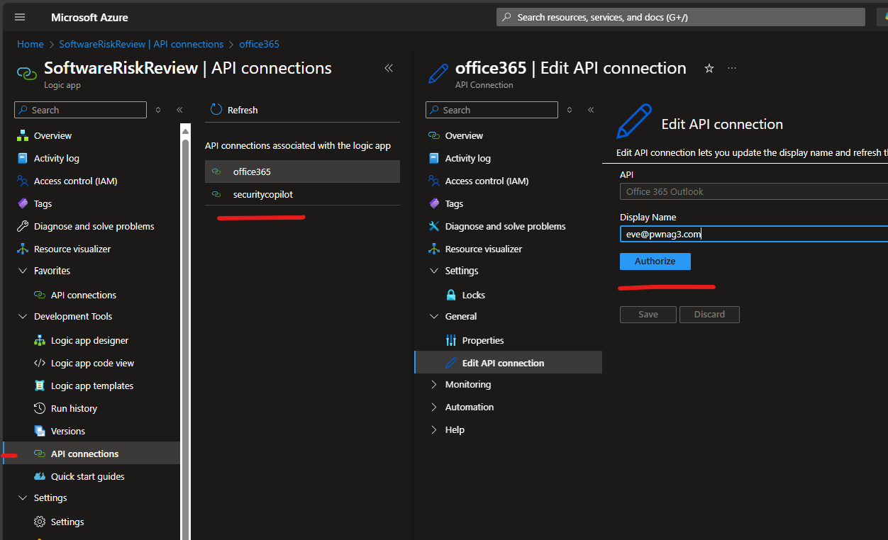

# Software Risk Review Automation

## Author: Craig Freyman

This solution automates Software Risk Reviews by integrating an Azure Logic App, Azure Function Apps, and a Microsoft Security Copilot Promptbook. It triggers on incoming emails requesting a review, performs real-time web research using Azure OpenAI, and generates an assessment of the software.

---

## Overview

1. **Trigger** on new emails to a shared mailbox with subject line: `SoftwareRiskReview: <SoftwareName>`
2. **Extract** the software name using regex in a Function App
3. **Enrich** with AI-powered web research (DuckDuckGo + Azure OpenAI)
4. **Submit** to Security Copilot for a risk evaluation using a Promptbook

---

## Email Format

Send an email with the following subject line format:

```
SoftwareRiskReview: Dovetail
```

No attachments are required. The Logic App uses the subject line for input parsing.

---

## Deployment Instructions

Follow these steps to fully deploy the solution:

### 1. Deploy the Security Copilot Promptbook

Refer to the following prompts to create your promptbook:  
[PromptBookPrompts.md](https://github.com/cd1zz/securitycopilot/blob/main/LogicApps/SoftwareRiskReview/PromptBookPrompts.md)

Create a Promptbook following this guide:  
[Creating Promptbooks in Copilot for Security](https://rodtrent.substack.com/p/creating-promptbooks-in-copilot-for)

---

### 2. Retrieve the Promptbook ID

After creating the Promptbook:

- Open **Promptbook Library** in the Security Copilot interface
- Open your Promptbook
- Copy the **GUID** from the browser’s address bar — this will be needed during Logic App deployment



---

### 3. Create an Azure OpenAI Resource

You can only deploy specific OpenAI models if the selected region supports them (e.g., GPT-4.1 requires East US 2 or Sweden Central as of 04/25/2025).

```powershell
az cognitiveservices account create `
  --name TheNameOfYourInstance `
  --resource-group yourresourcegroup `
  --kind OpenAI `
  --sku S0 `
  --location ResourceGroupLocation `
  --custom-domain TheNameOfYourInstance `
  --yes
```

**Purpose:**  
Creates an Azure OpenAI resource, required before deploying models like GPT-4, GPT-4.1, or GPT-4o.

**Parameter details:**

- `--name`: The Azure OpenAI resource name
- `--resource-group`: Target Azure Resource Group.
- `--kind`: Must be `OpenAI`.
- `--sku`: Pricing tier (only `S0` is available).
- `--location`: Deployment region (must support the desired model).
- `--custom-domain`: Friendly DNS prefix for the endpoint.
- `--yes`: Auto-confirms creation.

**Reference:**  
[az cognitiveservices account create](https://learn.microsoft.com/en-us/cli/azure/cognitiveservices/account?view=azure-cli-latest#az-cognitiveservices-account-create)

---

### 4. Deploy the Model (e.g., `gpt-4o`)

After the resource is created, deploy the model into it.

```powershell
az cognitiveservices account deployment create `
  --name thenameofyourinstance `
  --resource-group yourresourcegroup `
  --deployment-name gpt-4o `
  --model-name gpt-4o `
  --model-version "2024-11-20" `
  --model-format OpenAI 
```

**Purpose:**  
Installs a model deployment inside the OpenAI resource, enabling API access via the assigned deployment name.

**Parameter details:**

- `--name`: The Azure OpenAI resource name.
- `--resource-group`: The same resource group.
- `--deployment-name`: Logical deployment name (used in API calls, e.g., `"gpt-4o"`).
- `--model-name`: Base model being deployed.
- `--model-version`: Specific version of the model.
- `--model-format`: Must be `OpenAI`.

**Reference:**  
[az cognitiveservices account deployment create](https://learn.microsoft.com/en-us/cli/azure/cognitiveservices/account/deployment?view=azure-cli-latest#az-cognitiveservices-account-deployment-create)

---

### 5. Deploy the Function App

Handles AI summarization and software name extraction.

[](https://portal.azure.com/#create/Microsoft.Template/uri/https%3A%2F%2Fraw.githubusercontent.com%2Fcd1zz%2Fsecuritycopilot%2Frefs%2Fheads%2Fmain%2FLogicApps%2FSoftwareRiskReview%2Ffunctionapp_azuredeploy.json)

---

### 6. Deploy the Logic App

Orchestrates the full workflow: email trigger → function calls → Security Copilot interaction. You will need several values from the OpenAI deployment, which you can get through the AI Foundry Portal or with this powershell:

```powershell
$resourceName = "OpenAIInstanceNamedAbove"
$resourceGroup = "ResourceGroup"

$deployment = az cognitiveservices account deployment list `
  --name $resourceName `
  --resource-group $resourceGroup `
  --query "[0]" | ConvertFrom-Json

$endpoint = az cognitiveservices account show `
  --name $resourceName `
  --resource-group $resourceGroup `
  --query "properties.endpoint" `
  -o tsv

$key = az cognitiveservices account keys list `
  --name $resourceName `
  --resource-group $resourceGroup `
  --query "key1" `
  -o tsv

Write-Output @"
AZURE_OPENAI_API_VERSION=$($deployment.properties.model.version)
AZURE_OPENAI_DEPLOYMENT_NAME=$($deployment.name)
AZURE_OPENAI_ENDPOINT=$endpoint
AZURE_OPENAI_KEY=$key
AZURE_OPENAI_MODEL=$($deployment.properties.model.name)
"@
```

[](https://portal.azure.com/#create/Microsoft.Template/uri/https%3A%2F%2Fraw.githubusercontent.com%2Fcd1zz%2Fsecuritycopilot%2Frefs%2Fheads%2Fmain%2FLogicApps%2FSoftwareRiskReview%2Flogicapp_azuredeploy.json)

### 6. Post Deployment - API Connections

Open the Office 365 and the Security Copilot API connections and make sure the connections are properly authorized:



---

## Prerequisites

- Azure OpenAI resource with a deployed model
- Function App environment variables configured:
  - `AZURE_OPENAI_API_VERSION`
  - `AZURE_OPENAI_DEPLOYMENT_NAME`
  - `AZURE_OPENAI_ENDPOINT`
  - `AZURE_OPENAI_KEY`
  - `AZURE_OPENAI_MODEL`
- Authorized Logic App connectors:
  - Office365 (shared mailbox access)
  - Security Copilot (Promptbook invocation)
- Deployed Promptbook and Promptbook ID available

