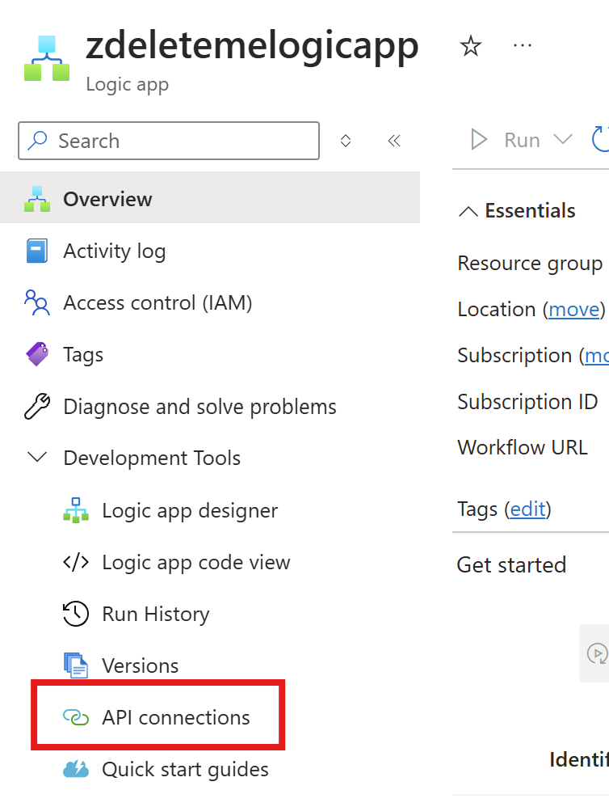
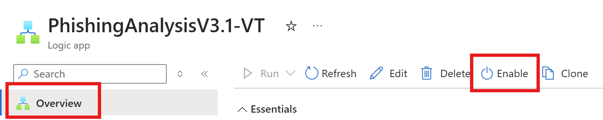

Here is the updated Markdown file for your project, modified to align with the new GPT core prompt for structured analysis and detailed phishing email investigation:

```markdown
# User Submitted Phishing Analysis with Security Copilot
Author: Craig Freyman

This solution automates the analysis of user-submitted phishing emails using Security Copilot. It monitors a shared Office 365 mailbox, triggering a Logic App upon new email arrival. The Logic App processes the email using a Function App, which extracts relevant details, sends an HTML report, and automatically adds the results of the analysis to the comments of the associated Defender or Sentinel incident.

### **Core Analysis Context**
This solution is designed to detect sophisticated phishing attempts, spam, and ambiguous communications. Emails are analyzed based on behavioral triggers, intent, inconsistencies, and organizational context. The goal is to classify emails as **Phishing**, **Junk/Spam**, **Legitimate**, or **Suspicious**, while providing actionable insights.

---

## Deploy the Solution

### Step 1: Deploy the Function App

Click the button below to deploy the Function App. You'll be prompted to select or create a resource group and provide a unique Function App name. Ensure the Function App is fully deployed before starting the Logic App deployment.

[](https://portal.azure.com/#create/Microsoft.Template/uri/https%3A%2F%2Fraw.githubusercontent.com%2Fcd1zz%2Fsecuritycopilot%2Fmain%2FPhishingLogicApp%2FPhishingLA_Sentinel_Comments%2Ffunctionapp_azuredeploy.json)

If you run into issues, you can create a skeleton/empty Function App and deploy via the command line:
```bash
az functionapp deployment source config-zip --resource-group yourresourcegroup --name youremptyfunctionapp --src .\FunctionApp.zip
```
Download the ZIP file to your local directory before running the command.

### Step 2: Deploy the Logic App

Click the button below to deploy the Logic App. Note your Function App name and resource group from the previous step. You will enter this information in the deployment screen.

[](https://portal.azure.com/#create/Microsoft.Template/uri/https%3A%2F%2Fraw.githubusercontent.com%2Fcd1zz%2Fsecuritycopilot%2Frefs%2Fheads%2Fmain%2FPhishingLogicApp%2FPhishingLA_Sentinel_Comments%2Flogicapp_azuredeploy.json)

---

### **Logic App Workflow Details**

- **Monitors a Shared Office 365 Mailbox**: Automatically triggers when a new email is received.
- **Processes Email Content**: Extracts key details like sender, recipient, subject, URLs, and attachments.
- **Generates an HTML Report**: Provides a structured analysis of the email and its potential risks.
- **Updates Sentinel Incidents**: Adds the analysis results to the incident comments for enhanced visibility.

---

### **Core GPT Prompt for Email Analysis**

The solution leverages Security Copilot to analyze phishing emails using a structured and comprehensive methodology, which includes:

1. **Behavioral Triggers Analysis**  
   - Detect coercive or emotional language.
   - Classify the tone and evaluate its alignment with the email's stated purpose.

2. **Logical Coherence**  
   - Assess consistency of email content and requests.
   - Identify contradictions, vagueness, or illogical actions.

3. **Contextual Integrity Analysis**  
   - Evaluate plausibility of content, terminology, and formatting.
   - Flag placeholder data or repetitive information.

4. **Intent Verification**  
   - Infer sender's likely intent.
   - Assess risks associated with the email's requests.

5. **Attachment and URL Analysis**  
   - Analyze attachments for relevance and risk.
   - Categorize URLs and evaluate alignment with trusted domains.

6. **Subtle Clue Detection**  
   - Identify unusual details that deviate from standard workflows or behavior.

7. **Final Assessment**  
   - Classify emails as **Phishing**, **Junk/Spam**, **Legitimate**, or **Suspicious** based on all identified elements.

---

### **Steps for Configuration**

1. **Initialize O365 and Security Copilot API Connections**
   Open your new Logic App, click **API Connections**, and authorize both connections.

   

2. **Enable the Logic App**
   Ensure the Logic App is enabled to start processing emails.

   

3. **Customize Function App**
   If modifying the Function App, repackage the `FunctionApp.zip` file with changes. Include the `.python_packages` folder as it is required for deployment.

---

### **Output Example for Structured Analysis**

The email analysis output follows this JSON structure for consistent reporting:
```json
{
  "email_summary": { "subject": "", "content_summary": "" },
  "behavioral_triggers": { "tone": "", "alignment_with_purpose": "" },
  "logical_coherence": { "is_consistent": "FALSE", "subtle_inconsistencies": [] },
  "contextual_integrity": { "plausibility": "FALSE", "issues": [] },
  "intent_verification": { "likely_intent": "", "risk_assessment": "" },
  "attachment_analysis": { "is_relevant": "FALSE", "risks": "" },
  "url_analysis": { "url_categorization": {}, "primary_action_validation": {} },
  "pretense_vs_intent_mapping": { "stated_purpose": "", "true_intent": "" },
  "subtle_clue_detection": { "clues": [] },
  "final_assessment": { "category": "", "rationale": "" }
}
```

---

### Deployment Notes
If you want to change the Function App code, clone the repository and modify it locally. Repackage the `FunctionApp.zip` file for deployment. Ensure the `.python_packages` folder is included for proper dependency management.

---

This updated Markdown file reflects the enhanced structured analysis and organizational context for phishing email detection.
``` 

Let me know if you need additional adjustments or edits!